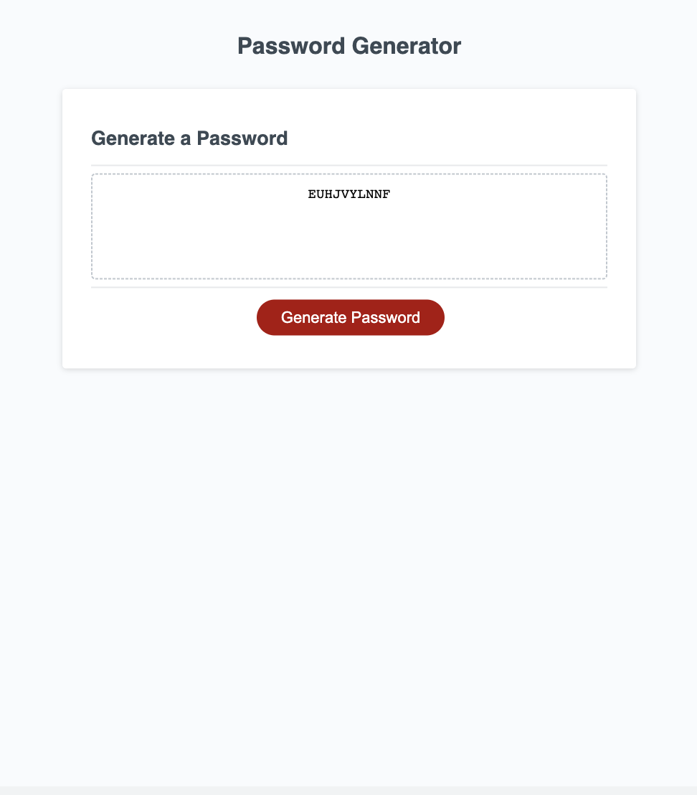

# password_generator

## Description

This is a password generator created from HTML, CSS, and JavaScript. 

## Installation

N/A

## Usage

The password generator allows the user to generate a password of 8-128 characters with a random combination of uppercase and lowercase letters, numbers, and special characters.

[website]()

## Credits

N/A

## License

N/A